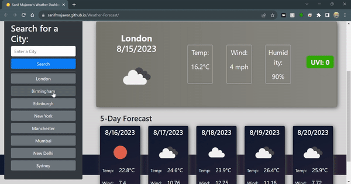

# WeatherDashboard

## Overview 
Welcome to the Weather Forecast App project!  Build a dynamic weather dashboard that provides users with up-to-date weather information for multiple cities. This app will allow users to plan their trips effectively by presenting the current and future weather conditions. Utilize the 5 Day Weather Forecast API to retrieve weather data, and leverage localStorage to store persistent data.

## Features:

 Current weather
 
 5-day forecast
 
 Search bar
 
 History of searches accessible with a click of a button
 
 History saved to localStorage
 
 Smooth transitions
 
 Weather backgrounds for each weather type
 
 Animated loader
 
Built using jQuery, Bootstrap 5, moment.js, day.js and Openweathermap API services.

## Instructions 📝
To use the Weather Forecast App:

Open the Weather Forecast App in your web browser. 

Enter the name of the city you want to get weather information for.

Click the "Search" button.

The current weather conditions and 5-day forecast for the city will be displayed.

The searched city will be added to the search history for quick access.

## Screenshots 

## Technical Acceptance Criteria 

The application retrieves weather data using the 5 Day Weather Forecast API.

localStorage is used to store search history and weather data.

## Deployment Page

Accessing the Weather Forecast App : https://maxwella10.github.io/WeatherDashboard/

© 2023 Maxwell Acha Confidential and Proprietary. All Rights Reserved.
